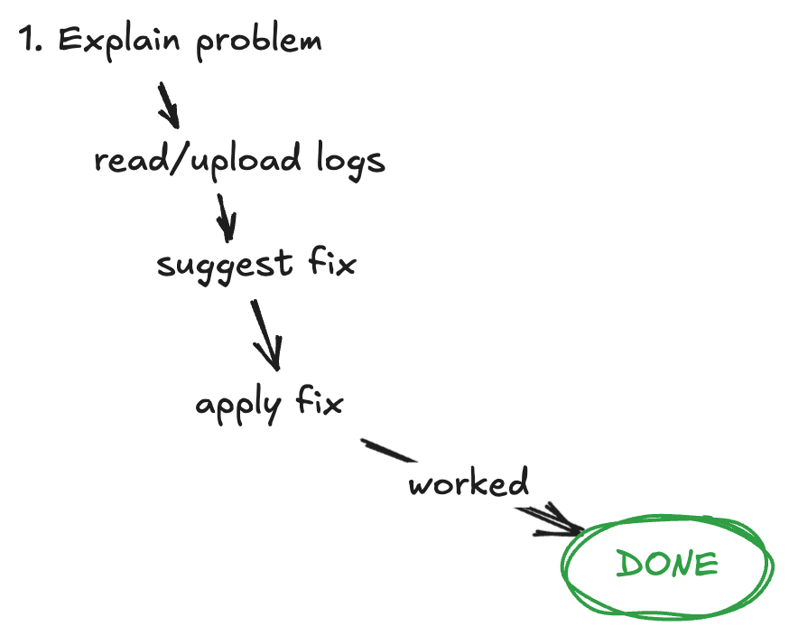
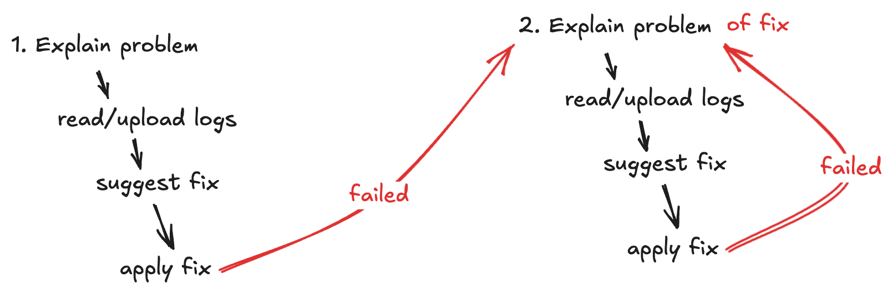
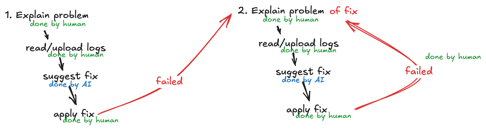
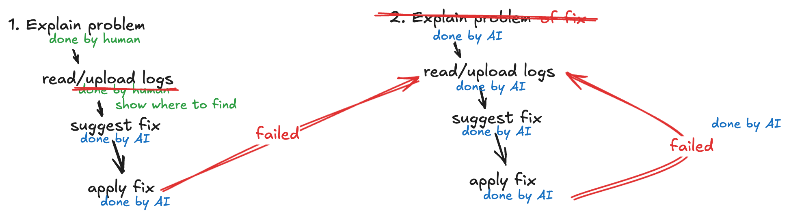

# How does AI code make me happy?

## Ideal workflow of a AI chat bot

## Workflow of an AI chat bot with bad suggestion/fix

## Workflow of an AI chat bot: lots of manual steps

Coding agents run on your local machine
and execute commands in your terminal.

-> lots of automation potential

## Workflow of Coding agents: Automated loop

Precondition: 

Success of fix is measureable by executable command.