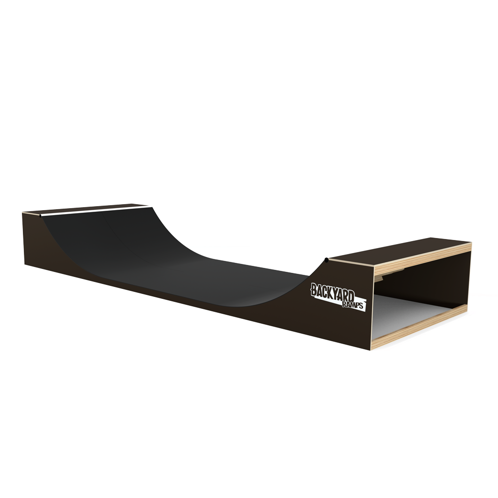

# Miniramp fuer die Oeffentlichkeit

Ich will eine [Skateboard Miniramp 750 x 375 x 100 cm](https://www.backyard-ramps.com/skateboard-miniramp-750x375x100) kaufen, auf einem oeffentlichen Platz bauen und sie der Oeffentlichkeit zur 
 Verfuegung stellen. 

[Skater auf Miniramp Video](https://www.backyard-ramps.com/galerie-skateboard-rampen?pgid=kvdpn4yx-a37fb2e7-b727-48e3-9a27-ee5d4e6bd559)

## Backyard-Ramps' Erfahrungen mit ihren Rampen auf oeffentlichen Plaetzen

Wurden Miniramps von Backyard Ramps schon mal oeffentlichen zur Verfuegung gestellt? Hier ihre Antwort:

Einsschaetzung eines Baurecht-Anwalts:

Also bauordnungsrechtlich müsste das eigentlich eine verfahrensfreie bauliche Anlage sein (kann man wohl irgendwie unter Spielplätze oder sonstige unbedeutende Anlagen in Art. 57BayBauO subsumieren), allerdings kann die Bauaufsicht natürlich trotzdem tätig werden wenn sie das möchte und soetwas ggf. abnehmen (Art. 77 f. BayBauO).
Das sagt dann allerdings noch nichts über die (laufenden) Verkehrssicherungspflichten während des Betriebs.
Da ist aber die Stadt wie gesagt der kundige Ansprechpartner, da sie die ja auch an allen anderen öffentlichen Anlagen erfüllt. 

## Offen

- Erlaubnis von der Stadt
- Abhahme durch TUEV / Bauamt
- Laufende Verkehrssicherungspflichten waehrend des Betriebs
- Ort: Vorzugsweise in der Naehe vom alten Amtsgericht :)

